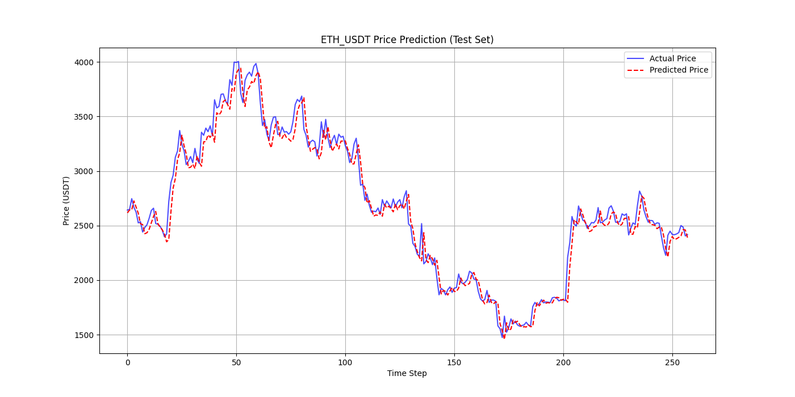
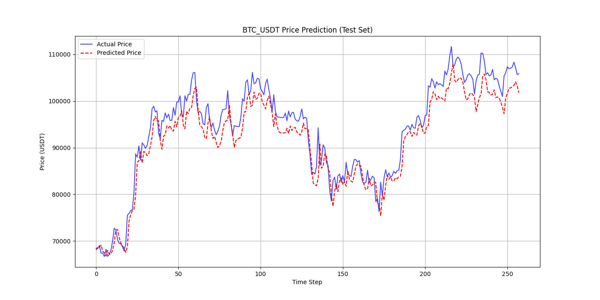
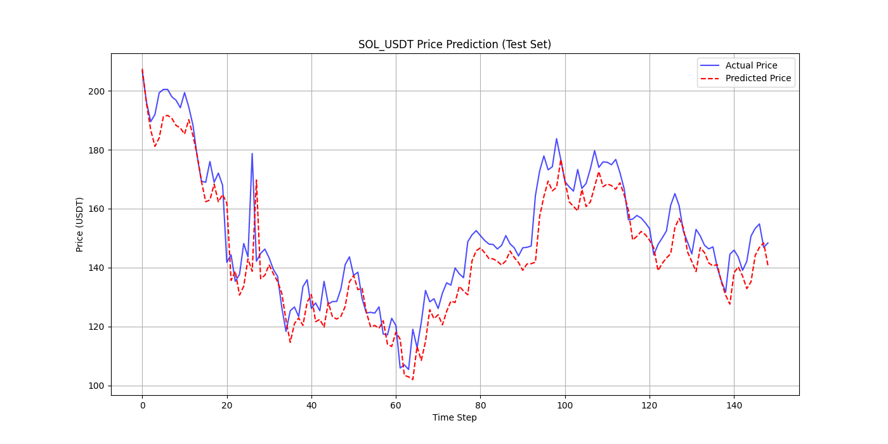
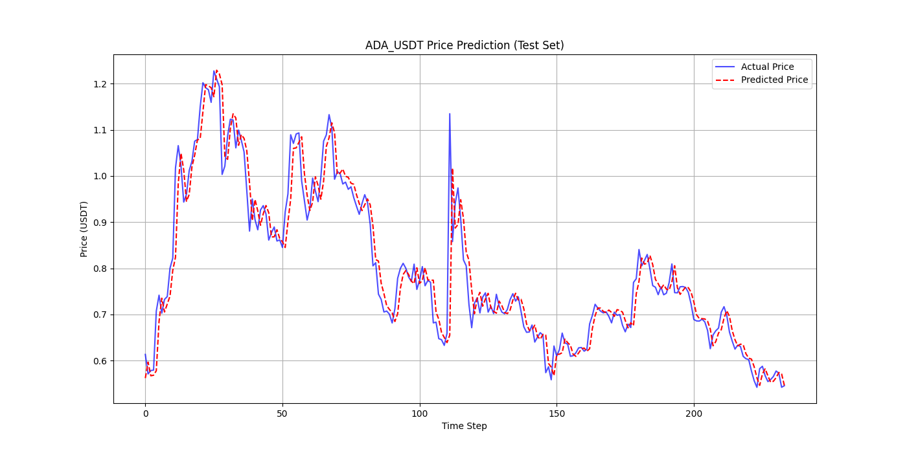
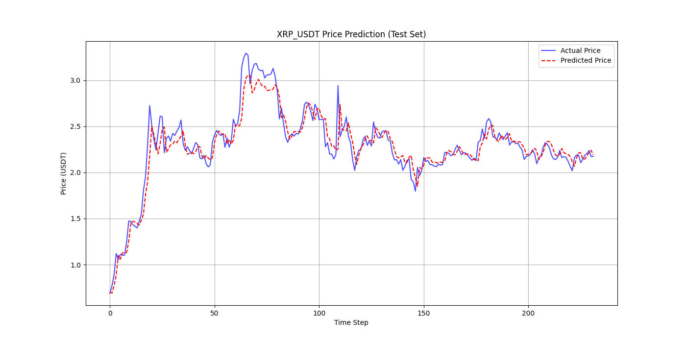

# 🚀 CryptoVertex: Navigation Crypto Price Trend

**CryptoVertex** is an interactive web application for navigating and forecasting cryptocurrency price trends. It leverages real-time data, technical indicators, and deep learning models (LSTM & GRU) to provide users with insights into market direction and future price predictions — all wrapped in a clean Flask-based interface with beautiful visualizations powered by Chart.js.

---

## 📌 Project Overview

CryptoVertex was developed as a full-stack data science project to demonstrate how machine learning and deep learning models can be applied to the financial domain — specifically, cryptocurrency price prediction. The project involves scraping live crypto data, applying financial technical indicators, training deep learning models, and delivering real-time interactive output through a web application.

---

## 🧠 Key Features

- 📥 **Real-time Data Scraping**  
  Fetches OHLCV (Open, High, Low, Close, Volume) data using cryptocurrency APIs.

- 🧼 **Data Preprocessing & Cleaning**  
  Cleans data, handles missing values, and formats timestamps for time-series modeling.

- 📈 **Feature Engineering**  
  Adds financial technical indicators:
  - **RSI** (Relative Strength Index)
  - **EMA** (Exponential Moving Average)
  - **SMA** (Simple Moving Average)

- 🔮 **Deep Learning Models**  
  - **LSTM** (Long Short-Term Memory)
  - **GRU** (Gated Recurrent Unit)  
  for forecasting future crypto price trends.

- 🌐 **Flask Web Application**  
  Lightweight and user-friendly interface for running predictions.

- 📊 **Chart.js Visualizations**  
  Interactive price charts, indicator overlays, and prediction plots.

---

## 🛠️ Tech Stack

| Category        | Tools/Libraries                                      |
|----------------|------------------------------------------------------|
| Programming     | Python                                               |
| Data Handling   | Pandas, NumPy                                        |
| Indicators      | TA-Lib / Custom Indicator Functions                  |
| Deep Learning   | TensorFlow / Keras                                   |
| Web Framework   | Flask                                                |
| Visualization   | Chart.js, HTML, CSS, JavaScript                      |

---

## 🚀 How to Use

Follow these steps to run the application locally:

### 1️⃣ Create a Virtual Environment

```bash
python -m venv venv

pip install -r requirements.txt

python app.py

```
## 🔄 End-to-End Flow

- Running app.py automatically triggers the full pipeline:
- Fetches crypto data
- Applies technical indicators
- Trains LSTM and GRU models
- Generates future price predictions
- Renders interactive charts

✅ No manual steps required — everything runs seamlessly in the backend.

## 🖼️ Screenshots of Model Prediction











## 🚧 Limitations & Future Improvements
While CryptoVertex demonstrates strong potential, here are known limitations and enhancement plans:

#### Current Limitations:
- Training time can be long for large datasets
- Currently supports only a single crypto (e.g., BTC, ETH and 3 more)

#### Future Improvements:
- Add support for multiple cryptocurrencies
- Deploy model in production using Docker/Render
- Add portfolio simulation and risk metrics

## 📄 License

This project is licensed under the [MIT License](LICENSE).

---

© 2025 Muhammad Adnan
